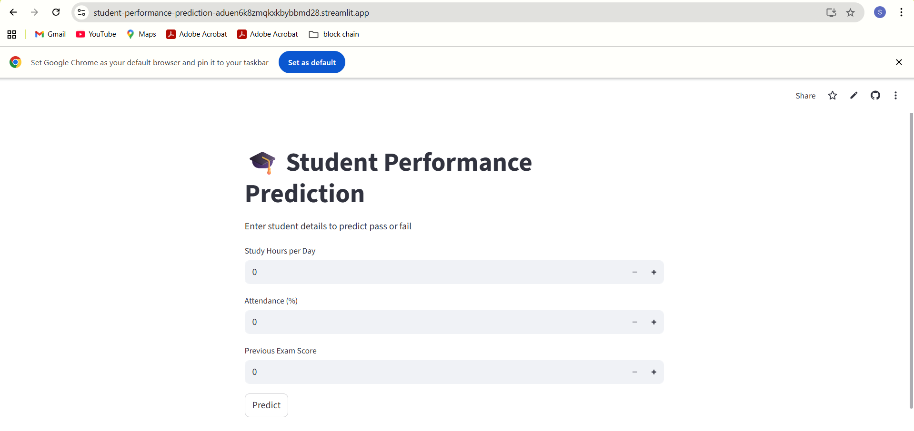
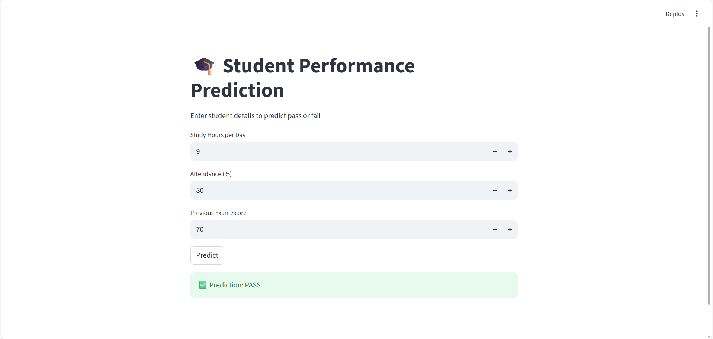
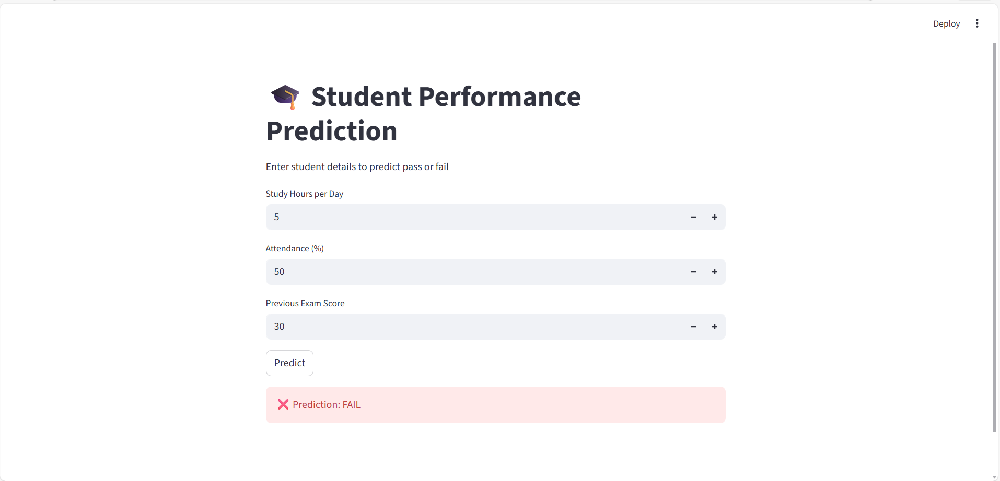

# 🎓 Student Performance Prediction using Machine Learning

This project predicts whether a student will **PASS or FAIL** based on study hours, attendance percentage, and previous exam scores using Machine Learning.

---

## 🔗 Live Demo
https://student-performance-prediction-aduen6k8zmqkkbybbmd28.streamlit.app

## 🚀 Tech Stack
- Python  
- Pandas, NumPy  
- Scikit-learn  
- Streamlit  

---

## 🧠 Machine Learning Model
- Algorithm: Logistic Regression  
- Task: Binary Classification (Pass / Fail)  
- Evaluation: Accuracy Score  

---

## 📊 Application Screenshots

### 🏠 Home Page

---

### ✅ Pass Prediction

---

### ❌ Fail Prediction

---

## ▶ How to Run the Project

1. Install required libraries:
pip install pandas numpy scikit-learn streamlit joblib

2. Run the Streamlit app:
streamlit run app.py

3. Enter student details and click **Predict**.

---

## 📌 Project Outcome
The system predicts student academic performance in real time and classifies results as **PASS** or **FAIL** based on input parameters.

---

## 👩‍💻 Author
Sneha S  
MCA – Artificial Intelligence & Machine Learning
